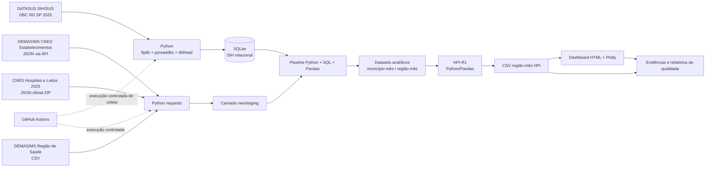

# ARQUITETURA AS-BUILT — SENSUS HEALTH AI / SPRINT 2

## Estado

**As-built do MVP efetivamente implementado e validado.** Este documento substitui, para fins de Sprint 2, a arquitetura proposta na Sprint 1 sempre que houver divergência entre intenção e implementação.

## Fluxo implementado

## Camadas reais

### 1. Fontes

- **SIH/SUS AIH Reduzida (RD)** — FTP oficial DATASUS; 12 competências de SP/2025.
- **CNES Estabelecimentos** — JSON via API oficial para identificação/enriquecimento dos 637 CNES observados no SIH.
- **CNES Hospitais e Leitos 2025** — JSON anual oficial para capacidade histórica mensal.
- **Região/Macrorregião de Saúde** — CSV oficial para regionalização dos municípios.

### 2. Ingestão

- Python 3.11+;
- `ftplib` para SIH;
- `requests` para APIs/recursos HTTP;
- `pyreaddbc` + `dbfread` para DBC→DBF→DataFrame.

### 3. Persistência/staging

- SIH consolidado em **SQLite relacional** (`sih_sp_2025.sqlite`), não versionado no Git devido ao volume.
- JSON/CSV brutos preservados em runtime/artefatos, com metadados e hashes.

### 4. Processamento analítico

- SQL sobre SQLite para redução inicial da demanda;
- Python/Pandas para normalização, joins, agregações e validações;
- capacidade associada por **município + competência**;
- saída por município-mês e região de saúde-mês.

### 5. Indicadores

- proxy de pressão de permanência por leitos SUS;
- AIH distintas por leito SUS;
- HPI-R1 como combinação 50/50 de percentis mensais dos dois componentes;
- classificação relativa por quartis.

### 6. Consumo

- CSVs analíticos;
- dashboard HTML navegável com Plotly;
- evidências PNG e relatórios Markdown/JSON.

## Componentes NÃO implementados nesta Sprint 2

Os componentes abaixo apareceram na arquitetura proposta/ideação, mas **não fazem parte do as-built** por ausência de evidência técnica de execução neste MVP:

- Oracle Database como camada Silver/Gold;
- Oracle Select AI;
- Databricks/Spark;
- Airflow;
- Redis;
- Power BI/Tableau como camada entregue;
- serviços cloud de deploy ainda não publicados/validados.

Eles devem aparecer, quando necessário, apenas em uma seção separada de **evolução futura**.

## Restrições metodológicas

- `DIAS_PERM` do SIH não deve ser chamado de taxa oficial de ocupação hospitalar.
- HPI-R1 é índice acadêmico relativo e não diagnóstico/regulatório.
- A arquitetura as-built descreve somente o que possui código, execução e saída verificável.
